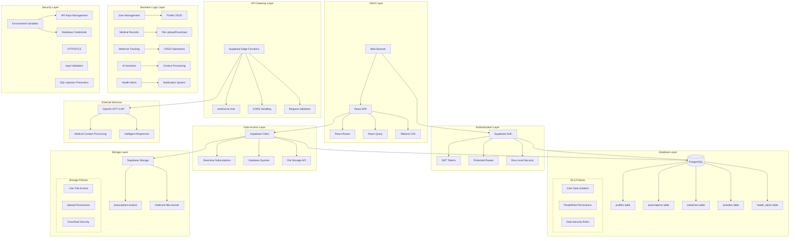

# Medical Health Tracker

A comprehensive digital health management platform with AI-powered assistance for tracking medical records, medicines, and health insights.

## 🏥 Project Overview

This application provides a complete solution for personal health management, featuring secure document storage, medication tracking, AI-powered health assistance, and real-time health alerts. Built with modern web technologies and integrated with Supabase for backend services.

## 🚀 Features

- **User Authentication & Profiles**: Secure sign-up/sign-in with comprehensive user profiles
- **Medical Records Management**: Upload, store, and organize medical documents
- **Medicine Tracker**: Track medications with dosage, frequency, and reminders
- **AI Health Assistant**: Chat with GPT-4 powered medical assistant
- **Health Alerts**: Real-time notifications and health reminders
- **Dashboard Analytics**: Overview of health statistics and recent activities

## 📋 Complete Development Prompt

### Core Requirements

Create a comprehensive Medical Health Tracker web application with the following specifications:

#### **Authentication & User Management**
- Supabase Auth integration with secure sign-up/sign-in
- User profiles with personal information, medical notes, emergency contacts
- Protected routes requiring authentication
- Row Level Security (RLS) for data isolation

#### **Dashboard Features**
- Health statistics overview (medical records count, current medicines, last checkup, health score)
- Recent activities feed with timestamps
- Health alerts with severity levels and dismiss/schedule functionality
- Quick action buttons for common tasks

#### **Medical Records System**
- File upload system supporting PDF and image formats
- Document categorization (Diagnostic, Prescriptions, Lab Reports)
- Search and filter functionality
- Secure file storage with download capabilities
- Drag-and-drop upload interface

#### **Medicine Management**
- Add medicines with detailed information (dosage, frequency, purpose, prescriber)
- Track active vs completed medicines with status updates
- Medicine history and timeline tracking
- File attachments for prescription documents
- Search and filter capabilities

#### **AI Medical Assistant**
- Integration with OpenAI GPT-4 API
- Context-aware responses based on user's medical history
- Quick question templates for common queries
- Suggestion system for follow-up questions
- Medical disclaimers and professional consultation reminders

#### **Health Alerts System**
- Create and manage health notifications
- Different severity levels (low, medium, high, critical)
- Alert types (reminder, warning, info)
- Mark as read functionality
- Scheduling for future reminders

#### **Technical Stack Requirements**
- **Frontend**: React 18 + TypeScript + Vite
- **Styling**: Tailwind CSS with custom design system
- **Backend**: Supabase (database, auth, storage, edge functions)
- **State Management**: React Query for server state
- **Routing**: React Router v6
- **UI Components**: Shadcn/ui component library
- **AI Integration**: OpenAI API via Supabase Edge Functions

#### **Database Schema**
```sql
-- Core tables with RLS policies
profiles: user information and preferences
prescriptions: medical document metadata and files
medicines: medication tracking and history
activities: user activity log
health_alerts: notification and reminder system

-- Storage buckets
prescriptions: for medical document files
medicine-files: for prescription attachments
```

#### **Security Requirements**
- All API keys stored as Supabase secrets
- Row Level Security policies for user data isolation
- Secure file upload with validation
- HTTPS enforcement
- Input validation and sanitization

## 🏗️ System Design

### Architecture Overview

The application follows a modern three-tier architecture:

#### **Presentation Layer (React Frontend)**
- Component-based architecture with TypeScript
- Responsive design with Tailwind CSS
- Real-time UI updates with React Query
- Protected routing with authentication guards

#### **Application Layer (Supabase Backend)**
- Authentication and authorization
- RESTful API with real-time subscriptions
- Edge Functions for AI integration
- File storage and management

#### **Data Layer (PostgreSQL + Storage)**
- Relational database with ACID compliance
- Row Level Security for data isolation
- Binary file storage with CDN delivery
- Automated backups and scaling

### Data Flow Architecture

```
User Interface → Authentication → API Gateway → Business Logic → Database
                     ↓              ↓              ↓              ↓
               JWT Tokens → Edge Functions → Supabase Client → PostgreSQL
                     ↓              ↓              ↓              ↓
               Route Guards → AI Processing → Real-time Sync → File Storage
```

### Integration Architecture

- **Frontend-Backend**: Supabase client with real-time subscriptions
- **AI Services**: Edge Functions proxy to OpenAI API
- **File Management**: Direct upload to Supabase Storage with policies
- **Authentication**: JWT-based with automatic token refresh

## 🔧 Architecture Level Diagram



## 💼 Business Proposal

### Executive Summary

**Digital Health Management Revolution**

The Medical Health Tracker addresses the critical need for centralized, intelligent health data management. With the global digital health market projected to reach $659B by 2025, our solution provides a comprehensive platform that empowers patients while reducing healthcare costs.

### Problem Statement

#### Current Healthcare Challenges
- **Fragmented Records**: Medical documents scattered across multiple providers
- **Medication Errors**: 125,000+ annual deaths from medication non-adherence
- **Limited Access**: Patients struggle to access their own health information
- **Poor Communication**: Disconnect between patients and healthcare providers
- **Manual Processes**: Time-consuming paper-based record keeping

### Solution Overview

#### Integrated Health Management Platform

**Core Value Propositions:**
1. **Centralized Records**: Secure cloud storage for all medical documents
2. **Smart Tracking**: Automated medication reminders and interaction warnings  
3. **AI Guidance**: Personalized health insights and recommendations
4. **Proactive Alerts**: Real-time health notifications and reminders
5. **Provider Integration**: Seamless sharing with healthcare professionals

### Market Opportunity

#### Growing Digital Health Sector
- **Total Addressable Market**: $659B by 2025
- **Growth Rate**: 25.1% CAGR
- **Key Drivers**: Aging population, chronic disease prevalence, digital adoption
- **Target Segment**: Personal health management ($45B subset)

### Competitive Advantages

#### What Sets Us Apart
- **AI-Powered Intelligence**: GPT-4 integration for personalized health insights
- **Comprehensive Platform**: All health data unified in one secure location
- **User-Centric Design**: Intuitive interface accessible to all demographics
- **Privacy-First Approach**: Advanced security with HIPAA-compliant architecture
- **Cost-Effective Solution**: Affordable subscription model with high value

### Business Model

#### Revenue Streams
**Freemium SaaS Model:**
- **Individual Basic**: Free (core features)
- **Individual Premium**: $9.99/month (advanced features, AI insights)
- **Family Plans**: $19.99/month (up to 5 members)
- **Enterprise Solutions**: Custom pricing for healthcare organizations

**Additional Revenue:**
- API licensing to healthcare providers
- White-label platform solutions
- Anonymized health analytics services

### Implementation Roadmap

#### Go-to-Market Strategy
- **Phase 1 (Q1)**: MVP launch with core features
- **Phase 2 (Q2)**: AI assistant and advanced analytics
- **Phase 3 (Q3-Q4)**: Provider integrations and enterprise features
- **Phase 4 (Year 2+)**: Advanced AI capabilities and global expansion

### Financial Projections

#### Investment & ROI
- **Initial Investment**: $500K for development and market entry
- **Break-even Point**: Month 18
- **Year 3 Revenue**: $5M ARR
- **Customer Metrics**: $50 CAC, $600 LTV, 12:1 LTV/CAC ratio
- **Projected ROI**: 300% by Year 3

### Key Benefits

#### For Patients
- 40% reduction in medication errors
- 60% faster access to medical information  
- 24/7 AI-powered health support
- Improved treatment adherence and outcomes

#### For Healthcare Providers
- Enhanced patient engagement and compliance
- Reduced administrative overhead
- Better patient outcomes through data insights
- Streamlined communication and record sharing

## 🛠️ Technologies Used

- **Frontend Framework**: React 18 with TypeScript
- **Build Tool**: Vite for fast development and builds
- **Styling**: Tailwind CSS with custom design system
- **UI Components**: Shadcn/ui component library
- **Backend**: Supabase (PostgreSQL, Auth, Storage, Edge Functions)
- **State Management**: React Query for server state management
- **Routing**: React Router v6 for client-side routing
- **AI Integration**: OpenAI GPT-4 API via Supabase Edge Functions
- **File Storage**: Supabase Storage with CDN delivery

## 🚀 Getting Started

### Prerequisites

- Node.js 18+ and npm
- Git for version control

### Local Development Setup

```bash
# Clone the repository
git clone <YOUR_GIT_URL>
cd <YOUR_PROJECT_NAME>

# Install dependencies
npm install

# Set up environment variables
cp .env.example .env.local
# Add your Supabase URL and keys

# Start development server
npm run dev
```

### Environment Variables

Create a `.env.local` file with:

```bash
VITE_SUPABASE_URL=your_supabase_url
VITE_SUPABASE_ANON_KEY=your_supabase_anon_key
```

## 📦 Deployment

### Quick Deploy

Simply open [Lovable](https://lovable.dev/projects/249064dd-60a3-475d-99f7-494548de2543) and click on Share → Publish.

### Manual Deployment Options

1. **Vercel**: `npx vercel --prod`
2. **Netlify**: Build and deploy `dist` folder
3. **GitHub Pages**: Enable Pages in repository settings

### Production Build

```bash
# Build for production
npm run build

# Preview production build locally
npm run preview
```

## 🔒 Security Features

- **Authentication**: Supabase Auth with JWT tokens
- **Authorization**: Row Level Security (RLS) policies
- **Data Protection**: End-to-end encryption for sensitive data
- **File Security**: Secure upload with validation and access controls
- **API Security**: Rate limiting and request validation
- **HTTPS**: Enforced secure connections

## 📚 API Documentation

### Supabase Tables

- **profiles**: User profile information and preferences
- **prescriptions**: Medical document metadata and storage references
- **medicines**: Medication tracking and history
- **activities**: User activity logs and timestamps
- **health_alerts**: Notification and reminder system

### Edge Functions

- **medical-ai-chat**: OpenAI integration for health assistance

## 🤝 Contributing

1. Fork the repository
2. Create a feature branch: `git checkout -b feature/amazing-feature`
3. Commit changes: `git commit -m 'Add amazing feature'`
4. Push to branch: `git push origin feature/amazing-feature`
5. Open a Pull Request

## 📄 License

This project is licensed under the MIT License - see the [LICENSE](LICENSE) file for details.

## 🆘 Support

- **Documentation**: [Lovable Docs](https://docs.lovable.dev/)
- **Community**: [Lovable Discord](https://discord.com/channels/1119885301872070706/1280461670979993613)
- **Issues**: Create an issue in this repository

## 🔗 Custom Domain

To connect a custom domain, navigate to Project > Settings > Domains and click Connect Domain.

Read more: [Setting up a custom domain](https://docs.lovable.dev/tips-tricks/custom-domain#step-by-step-guide)

---

**Project URL**: https://lovable.dev/projects/249064dd-60a3-475d-99f7-494548de2543